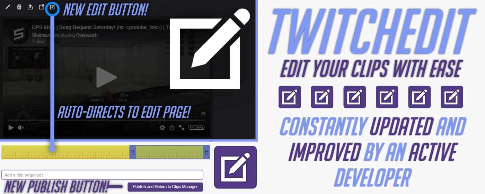

# TwitchEdit
### v1.5.0

After getting tired of spending the extra 10 seconds to navigate to my clip page directly, and then modify the URL by typing /edit at the end of it, I decided to write this little Chrome Extension which automates that process for you.  Once installed, any time you visit your clips page and click on a clip, you will see a brand new "Edit" icon which will take you directly to the clip in a **NEW TAB** (thank God) and allow you to edit it.

**Please note that this will not work if your clip has already been edited**

[Get it on the Chrome Web Store](https://chrome.google.com/webstore/detail/dechjnpdlchkchhgjnakdifhkdlhloob/publish-accepted?authuser=0&hl=en)

If you appreciate what I've done, please feel free to head over to my [Twitch channel](https://twitch.tv/ShermanZero) and drop a follow to show your support and appreciation!  I play a lot of Overwatch, and promote PMA!

# Changelog

**v1.5.0 (8/18/19)**
- Replaced the clip delete icon with custom delete icon which automates the clip deletion process
- Started adding functionality for a new clip feature

**v1.4.0 (8/16/19)**
- Changed the way the HTTP request is made to open a new tab to edit a clip
- Now, TwitchEdit also edits the clip page and replaces the standard "Submit" button with a "Submit and Return to Clips Manager" button that will automatically close the tab when your clip has finished processing
- Minor bug fixes

**v1.2 (08/15/19)**
- Fixed bug which prevented the extension from working on some channels

**v1.1 (08/14/19)**
- Overhaul to the UI, made it look like it's part of Twitch
- Added more comments and console.log() commands
- Create a popup.html page which displays info about the extension
- Took different screenshots

**v1.0 (08/13/19)**
- *Initial commit*

*This is technically open-source since I have made the code publicly available here to you all.  I could have simply created a repository with just a README, but decided to let you guys see what I've done.  You are welcome to clone, fork, download, or whatever this project for yourself, all I ask is that you leave my credits in the files wherever they appear.*
